# Claude Code に「規律」を入れる — 個人用キット yuki-aidd-kit の導入ガイド

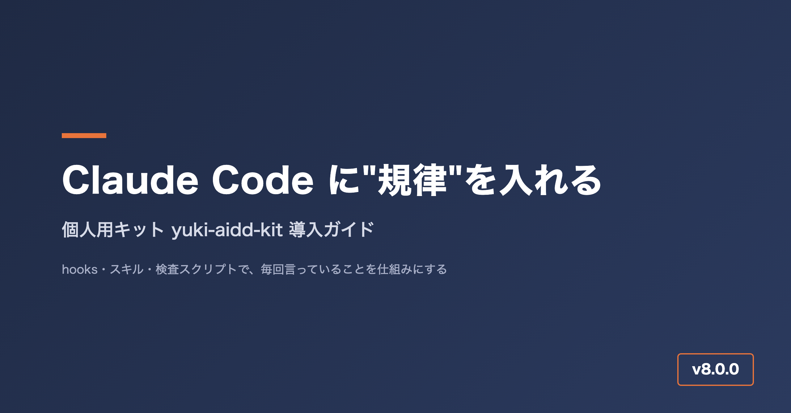

*yuki-aidd-kit の全体像を表したカバー画像*

Claude Code を毎日使っていると、同じ種類の困りごとに何度もぶつかります。

- 「完了しました」と言われて画面を開くと、動いていない
- 途中で「ちょっと待って」と書いても、手を止めずに作業を続けてしまう
- テストのログや `git diff` をそのまま読み込んで、あっという間にコンテキストが埋まる
- プロジェクトが変わるたびに、CLAUDE.md に同じ注意書きを貼り直している

このような「毎回言っていること」を、散文の注意書きではなく **hooks・スキル・検査スクリプト** に置き換えて持ち運べるようにしたのが、今回紹介する **yuki-aidd-kit（AIDD Kit）** です。AIDD は AI-Driven Development（AI 駆動開発）の略です。

この記事では、キットの考え方と全体像を中心に説明します。導入手順や1日の使い方は別の記事で扱います。

- リポジトリ: https://github.com/ma-garin/yuki-aidd-kit
- 記事執筆時点の版: 8.0.0（2026-09-21）
- 対象: Claude Code（または Codex）をすでに使っていて、規約・hooks・スキルをこれから整えたい方

---

## 1. なぜ作ったのか

### 「お願い」は守られない

最初は CLAUDE.md に「完了と言う前に動作確認すること」「テストはユーザーが頼んだときだけ回すこと」と書いていました。実際にどうなったかというと、たとえばこんな場面です。

- 長い調査タスクの途中で「そのアプローチだと後で困るから、いったん止めて」と割り込んだのに、直前のツール呼び出しの結果が返ってくるまで返事がなく、しかもそのまま次のステップに進んでしまう
- 「UI を直したら実機で確認してから完了と言って」と何度も書いているのに、コードを直しただけで「完了しました」と返ってくる
- 「テストはこちらが頼むまで実行しないで」と書いているのに、リファクタの途中で確認のつもりで pytest を回してしまい、無関係な既存の失敗まで拾って本題が埋もれる
- 会話が長くなるほど、これらの注意書き自体が CLAUDE.md の後ろの方に埋もれて、AI の目に触れる優先度が下がっていく

これらを引き起こしていたのは、次の 2 つの構造的な理由でした。

1. **CLAUDE.md の散文は「読まれる」だけで、「止める」力がない。** 自然文で書かれた注意事項は、他の文脈と同列のテキストとして扱われるため、割り込みの優先度も、ゲートとしての強制力も持ちません。守るかどうかは、そのターンでどれだけ注意深く文脈を読み返すかに依存してしまいます。
2. **注意書きが増えるほど毎ターン読み込む量が増え、肝心の作業に使えるコンテキストが減る。** 「あれもこれも守って」を全部散文で足していくと、規約を読むだけでコンテキストを消費し、実際の作業に使える余地が狭くなるという逆効果が起きます。

そこで方針を「書いて頼む」から「**仕組みで止める・仕組みで知らせる**」に切り替えました。たとえば「保守者の発言には作業より先に応答する」というルールは、hook が**ツールを呼ぶたびに「未応答の指示」を AI の文脈へ差し込む**形で実装しています。当初はこの hook で全ツールを止めていましたが、応答済みでも誤って止まってしまう不具合があったため、2026-09-21 に「ブロックする」方式から「通知する」方式に変更しました。今は指示に応答していなくても処理そのものは止まらず、次のツール呼び出しの直前に「まだ応答していない指示がある」という通知が差し込まれる仕組みです。

### 品質の基準を外部規格に寄せる

私は QA が本業なので、レビューやテストの観点は自作の分類ではなく ISO/IEC 25010・ISTQB・ISO/IEC/IEEE 29119 に寄せています。AI に「いい感じにレビューして」と頼むと、指摘の観点も severity の重さも毎回ぶれます。同じコードを見せても、ある回は表示崩れを重大指摘にし、別の回は軽微な言い回しの指摘に終始する、といったことが起きます。規格の品質特性と severity 分類をあらかじめ渡しておくと、指摘の粒度がそろい、レビュー結果を積み重ねて比較できるようになります。

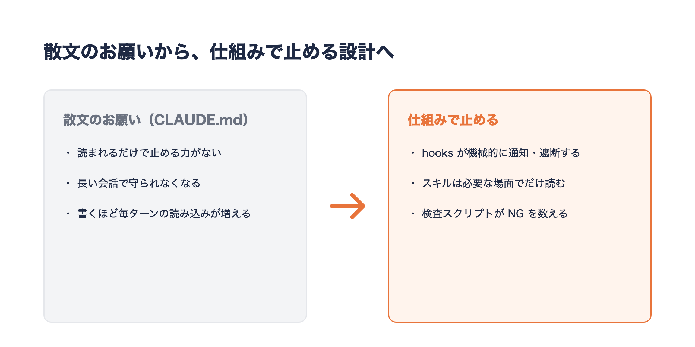

*「散文は守られない」と「品質観点がぶれる」という2つの困りごとが、hooksとスキルにそれぞれ対応する*

---

## 2. キットの全体像

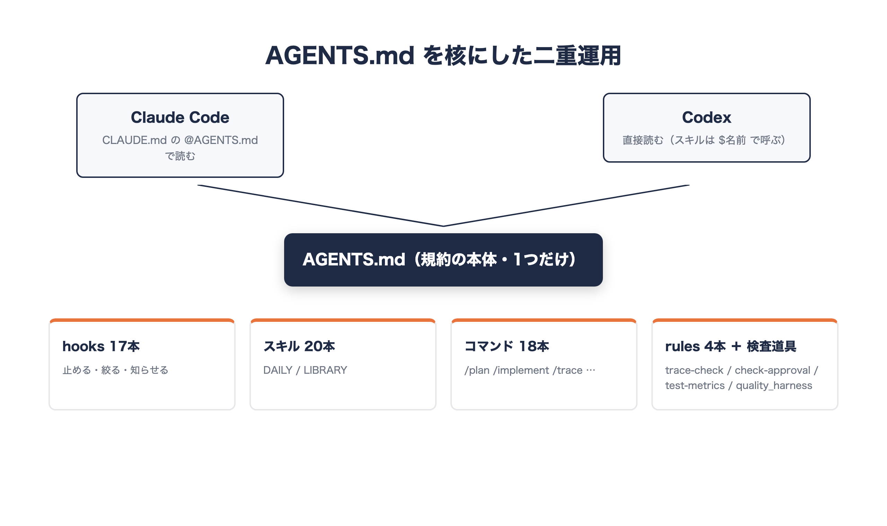

*hooks・スキル・コマンド・rulesの4種類の部品からなるキットの構成*

キットは大きく 4 種類の部品でできています。ポイントは、**規約の本体は `AGENTS.md` に 1 つだけ**置くことです。Claude Code は `CLAUDE.md` の `@AGENTS.md` で、Codex は `AGENTS.md` を直接読むので、両方のエージェントが同じ規約で動きます。

### hooks（機械的に強制するもの）

hooks は Claude Code の設定ファイルに配線しておくと、決まったタイミングで自動的に発火する小さなプログラムです。「何を・いつ・どう」で 1 本ずつ見ていきます。

- **`instruction-guard.py`**: 何を — 保守者（ユーザー）の発言に日本語で応答したかどうかを見る。いつ — 全ツールの呼び出し前（PreToolUse）。どう — 未応答の指示があれば、それを AI の文脈へ通知として差し込む。以前は全ツールを deny していたが、誤作動があったため 2026-09-21 に「止める」から「通知する」方式へ変更した
- **`reply-language.py`**: 何を — 直前の応答に日本語が含まれているか、指示に応答済みかを見る。いつ — 応答を終えて止まろうとするとき（Stop）。どう — 日本語が無い、または指示に未応答のまま終わろうとしていたら、続行させて書き直させる
- **`prompt-priority.py`**: 何を — ユーザーの発言に「今すぐ・報告・説明・なぜ・止め」などの語が含まれるか。いつ — ユーザーが発言を送った直後（UserPromptSubmit）。どう — 「作業より優先して応答すること」という注記を差し込む
- **`block-gates.py`**: 何を — Bash コマンドが pytest・make test・lint などの重いゲートかどうか。いつ — Bash 実行前。どう — ユーザーが明示的に頼んだ（`GATES_REQUESTED=1` が付いている）とき以外は実行を deny する
- **`block-ci.py`**: 何を — 自己起床の予約や `gh run watch` のような CI の起動・待機。いつ — 全ツールの呼び出し前。どう — deny する（Bash は `CI_REQUESTED=1` を付ければ許可）
- **`filter-output.py`**: 何を — テスト・install・build・`git log`・`git diff` の実行結果。いつ — Bash 実行前。どう — 全量を読み込む前に失敗行と集計に絞り込む（`FULL_OUTPUT=1` を付ければ全量を読める）
- **`pre-read-guard.py`**: 何を — 読もうとしているファイルの種類とサイズ。いつ — Read 実行前。どう — ロックファイル・minified・`node_modules`・生成レポートは読ませず、800 行を超えるファイルは先頭 300 行に絞る(続きは offset 指定で読む)
- **`block-explore.sh`**: 何を — 「実装モード」（`.claude/mode` の有無）かどうか。いつ — Read/Grep/Glob の実行前。どう — 実装モード中は探索系ツールをブロックし、調査と実装のフェーズを分離する
- **`block-phase.py`**: 何を — 前工程が承認済みかどうか(`.claude/phase-gate` の有無)。いつ — Write/Edit の実行前。どう — 未承認のまま次工程の成果物を書こうとしたら deny する(承認記録自体への書き込みは常に許可)
- **`pre-write-check.sh`**: 何を — 書き込み・編集しようとしているファイル。いつ — Write/Edit の実行前(PreToolUse)。どう — 秘密情報が書かれていそうなファイルや、単一 HTML ツールの CSS/JS を外部分割しようとする変更に警告する(ブロックはしない)
- **`post-write-html.sh`**: 何を — 保存した HTML ファイルの行数。いつ — Write/Edit の実行後(PostToolUse)。どう — 500 行を超えていたら部分編集を勧めるレポートを出す
- **`context-guard.py`**: 何を — 前回のやり取りから経過した時間(55分以上)や会話サイズ(4MB超)。いつ — ユーザー発言の直後。どう — `/clear` や `/compact` を促す注記を差し込む(止めない)
- **`pre-compact.py`**: 何を — 会話の圧縮が発生するタイミング。いつ — PreCompact。どう — 「何を残し、何を捨てるか」の指示を注入する
- **`log-instructions.py`**: 何を — 指示ファイル(CLAUDE.md や AGENTS.md 等)の読み込み。いつ — InstructionsLoaded。どう — `.claude/instructions-loaded.log` に記録するだけで、AI には何も返さない(実測用)
- **`progress.py`**: 何を — 1分を超える見込みの作業。いつ — 手動で bash コマンドに連結して呼ぶ。どう — `start` / `step` / `done` で `progress.json` を更新し、進捗を管理する
- **`statusline.py`**: 何を — 進行中タスクの経過時間・見積・残り、セッションの累計消費。いつ — ステータスラインの描画時。どう — これらを画面下部に表示する(該当するタスクが無いときは従来のステータスラインをそのまま表示)
- **`session-summary.sh`**: 何を — セッションの終了。いつ — Stop。どう — セッションの終了サマリを出す

### スキル(場面ごとの手順書)

20 本のスキルを同梱しています。どのプロジェクトでも使う **DAILY**(13 本)と、特定の種別でだけ使う **LIBRARY** の 2 層に分けています。

DAILY の 13 本を、1 行要約で並べます。

- `dev-lifecycle`: RFD → 要件定義 → 基本/詳細設計 → 実装 → 単体/結合/システム/受け入れテスト → 保守運用。工程ゲートとトレーサビリティ
- `context-compression`: 出力の3層要約・grep/glob優先・決定論的作業のスクリプト化でトークンを推論に温存
- `ecc-daily-router`: プロジェクトに合うECC資産をDAILY/LIBRARYに分類
- `sdd-ecc-workflow`: 仕様駆動開発の10ステップ。spec/plan/tasks生成と役割分離
- `qa-review-standards`: ISO 25010・ISTQB severity・Whittakerツアーをレビューに注入。evidence-only
- `atarimae-quality-audit`: 当たり前品質(Kano must-be)を発見者として徹底監査。症状の裏の欠陥クラスを全列挙し実機で目視
- `test-automation`: Playwright/pytestで「動いた」をテスト実行判定に置き換える
- `test-strategy`: テストレベル L1〜L4・ゲート基準・実行タイミング・変更タイプ別 DoD・機能契約ハーネス・UI 検証マーカー
- `e2e-cycle`: E2E を設計 → Playwright 生成 → 実行 → ODC 分析・修整 → コミットの5フェーズで段階停止しながら回す
- `phase-approval`: 工程の出口で AI 3 役を順次レビューし人間の承認に渡す。AI は承認しない
- `done-gate`: 完了宣言前の Definition of Done チェック
- `uiux_review`: 画面を実際に開いて全状態(通常/実行中/失敗/0件/狭い画面/モーダル)を確認する。「作った」を「効いている」と報告しない
- `retro`: AIDD の進め方の学びを `lessons.md` に蓄積しキットへ還流する

LIBRARY はプロジェクトの種別に合わせて選ぶスキル群です。代表的なものを挙げます。

- `design-system`: トークン(CSS変数の真実源)と画面の作り方(骨格・操作フィードバック・直値禁止)
- `nfr-standards`: PWA/単一HTML/Streamlit別の非機能要件のデフォルト値
- `agent-eval`: LLM/RAG/エージェント出力の品質をデータセット+スコアラーで回帰評価
- `single-html-tool`: 単一HTMLツール(社内配布・PoC)の開発規約
- `personal-pwa`: GitHub Pages PWA・localStorage・折りたたみ端末対応の開発規約
- `streamlit-rag-app`: Streamlit+RAG業務アプリの開発規約

### スラッシュコマンド

スキルを起動する入口として、18 本のスラッシュコマンドを用意しています。それぞれの役割です。

- `/rfd`: RFD(提案・論点出し)を起票し、決定を人間に求める
- `/lifecycle`: 指定工程の成果物を生成し入口/出口基準で判定する
- `/trace`: トレーサビリティの更新と機械検証を実行する
- `/test-metrics`: テスト工程の進捗・品質を数字で出し、検知と人が判定することを分けて報告する
- `/phase-review`: 工程の出口で AI 3 役を順次レビューし、差し戻し事項を出し切って人間の承認へ渡す
- `/plan`: 方針を確定し実装モードを解除する(探索を許可、PLAN.md を生成)
- `/implement`: 実装モードを開始する(plan 必須。探索を hook で物理ブロック)
- `/compact-work`: context-compression 規約で作業する(3層要約・スクリプト化)
- `/ecc-daily`: プロジェクトに合う ECC 資産の分類を実行する
- `/app-scan`: アプリワークスペースの軽量棚卸しを行う
- `/sdd-start`: SDD の spec/plan/tasks/CLAUDE.md を一気に生成する
- `/new-pwa`: 新規個人 PWA の spec からスキャフォールドまで生成する
- `/qa-review`: ISO/ISTQB 準拠のレビューを実行する
- `/e2e-cycle`: E2E の1フェーズだけ実行して停止する
- `/eval`: AI システムの eval を実行する(スコアラー選定〜回帰判定)
- `/doc-search`: 技術ドキュメント特化の検索を行う
- `/retro`: レトロを実行し `lessons.md` に追記する
- `/token-check`: トークン使用量の確認と最適化提案を行う

### rules(規律)と検査スクリプト

- rules: 絶対遵守ルール(A-1〜A-13)、開発速度ハーネス(H-1〜H-10)、モデル/effort の使い分け、機能完全性
- 導入先の `scripts/` で動く道具: トレーサビリティ検査 `trace-check.sh`、工程承認の検査 `check-approval.sh`、テストメトリクス集計 `test-metrics.sh`、機能契約ハーネス `quality_harness.py` など

これら 4 種類の部品を組み合わせることで、「規約を書いて頼む」から「規約を hook とスキルに埋め込んで、機械的に効かせる」という運用に変わります。

---

## 3. 導入の前に

### 必要なもの

- macOS または Linux のシェル環境（同梱のスクリプトはすべて bash です）
- Python 3（hooks 本体、導入スクリプトの一部、承認ゲートの判定処理が Python で書かれています）
- git（版の記録に `git rev-parse` を使っているため、キット自体を git clone した状態で実行します）
- Claude Code（Codex だけで使う場合は後述の「プロジェクト配布」方式を使います）

### 導入方式は 2 つ

1. **グローバル導入**（`install.sh`）: 自分の PC の `~/.claude` に配置します。複数のプロジェクトを横断して毎日使う場合はこちらです
2. **プロジェクト配布**（`export-project.sh`）: 対象プロジェクトの直下に `.claude/`・`AGENTS.md`・`CLAUDE.md`・`scripts/` を書き出します。生成物はそのプロジェクトの git にコミットする想定で、Codex、クラウド上の一時的な Claude Code 環境、チームメンバーが clone した環境など、`~/.claude` が使えない・使いたくない場合に向いています

2 つは排他ではなく、キット自体が併用を前提に作られています。自分の PC ではグローバル導入をベースにしつつ、特定のプロジェクトだけプロジェクト配布で固定する、という使い方もできます。迷ったらまずグローバル導入から始めるのがおすすめです。

### 既存の設定がある方へ（重要）

導入スクリプトは「壊さず退避する」ことを優先しています。具体的には次の 3 つの挙動を覚えておくと迷いません。

- 既存の `~/.claude/CLAUDE.md` と `~/.claude/AGENTS.md` は、実行するたびに `CLAUDE.md.bak` / `AGENTS.md.bak` へ退避してから置き換えます。つまり **2 回目以降の実行では前回の `.bak` が上書きされる**ので、独自に書いていた内容は導入直後に手動でマージしてください
- 既存の `~/.claude/settings.json` は**上書きしません**。ファイルが存在する場合はコピーをスキップし、「手動でマージしてください」というメッセージだけが表示されます。マージの参照元はキット内の `03_ClaudeCode/hooks/settings.json` です
- ただし「指示優先」の 3 つの hook（`instruction-guard.py` / `reply-language.py` / `prompt-priority.py` の配線）だけは例外で、既存の `settings.json` にも自動でマージされます。この処理は `install_guard.py` が担っており、何度実行しても同じ結果になる冪等な処理です。settings.json を後から手動マージした場合でも、もう一度実行して配線を確実にできます

なお、`install.sh` は完全新規導入と既存環境への追加導入のどちらでも同じ手順で実行できます。ただし CLAUDE.md / AGENTS.md の `.bak` は 1 世代しか残らないため、念のため導入前に `~/.claude` をまるごとバックアップしておくと安心です。

```bash
cp -R ~/.claude ~/.claude.backup-$(date +%Y%m%d)
```

---

## 4. 導入手順（グローバル導入）

### ステップ 1: リポジトリを取得する

```bash
cd ~/dev   # 置き場所は任意
git clone https://github.com/ma-garin/yuki-aidd-kit.git
cd yuki-aidd-kit
```

### ステップ 2: インストールする

```bash
./00_導入/01_インストール/install.sh
```

**何が起きるか**: `~/.claude` の下に `skills/` `commands/` `hooks/` rules/aidd-kit/ `scripts/` docs/aidd-kit/ を作り、キット本体のファイルをコピーします。CLAUDE.md と AGENTS.md はテンプレートから配置され（既存があれば前述の通り `.bak` に退避）、settings.json は既存が無い場合だけ新規作成されます。あわせて Codex 用に変換したスキルが `~/.agents/skills/` にも配布されます。実行中は「✅ スキル: n個」のようにコピーした件数が種類ごとに表示されます。

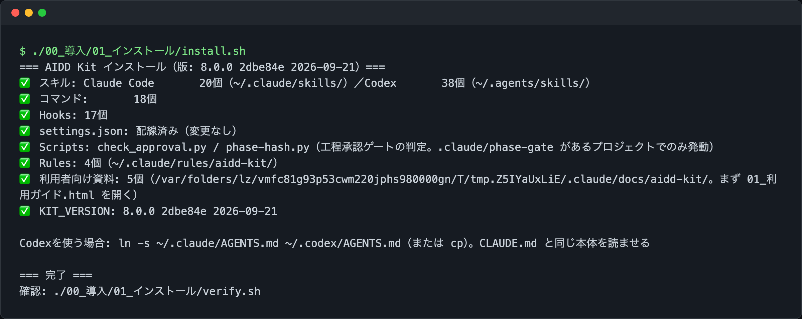

*install.sh を実行した直後のターミナル。スキル・コマンド・hooks・rules・利用者向け資料の配置件数が種類ごとに表示されます。*

**うまくいかないときの確認点**:

- `Permission denied` が出る場合は `chmod +x` が実行されていません。`bash ./00_導入/01_インストール/install.sh` のように bash 経由で直接実行すれば回避できます
- Python 3 が無いと「指示優先」3 hook の自動マージ処理（`install_guard.py`）が失敗します。`python3 --version` で存在を確認してください
- 途中で `⚠ 既存のCLAUDE.mdを CLAUDE.md.bak に退避` と表示された場合はエラーではありません。後述のステップ 5 で手動マージしてください

### ステップ 3: 指示優先の hook を入れる

```bash
./00_導入/01_インストール/install-guard.sh
```

ステップ 2 の内部でも同じ処理（`install_guard.py`）が呼ばれているため、通常は明示的に実行する必要はありません。settings.json を手動でマージした**後**にもう一度実行しておくと、指示優先の 3 hook の配線が確実に settings.json に入っていることを再確認できます。この処理は冪等なので、何度実行しても差分がなければ「変更なし」という趣旨の表示になるだけです。

### ステップ 4: 配置を確認する

```bash
./00_導入/01_インストール/verify.sh
```

**何が起きるか**: `~/.claude` 配下の各資産（グローバル設定・スキル・コマンド・hooks・判定スクリプト・rules）を 1 つずつ調べ、存在すれば `✅`、無ければ `❌（未配置: パス）` を表示します。チェックリストはキットのリポジトリ実体（`03_ClaudeCode/` 配下の skills・commands・hooks）から自動的に導出されるため、キットに資産が増えても `verify.sh` 自体の更新は不要です。最後に `結果: OK=n / NG=m` と表示され、導入済みの版（`KIT_VERSION`）とリポジトリの版（git commit）も併記されます。

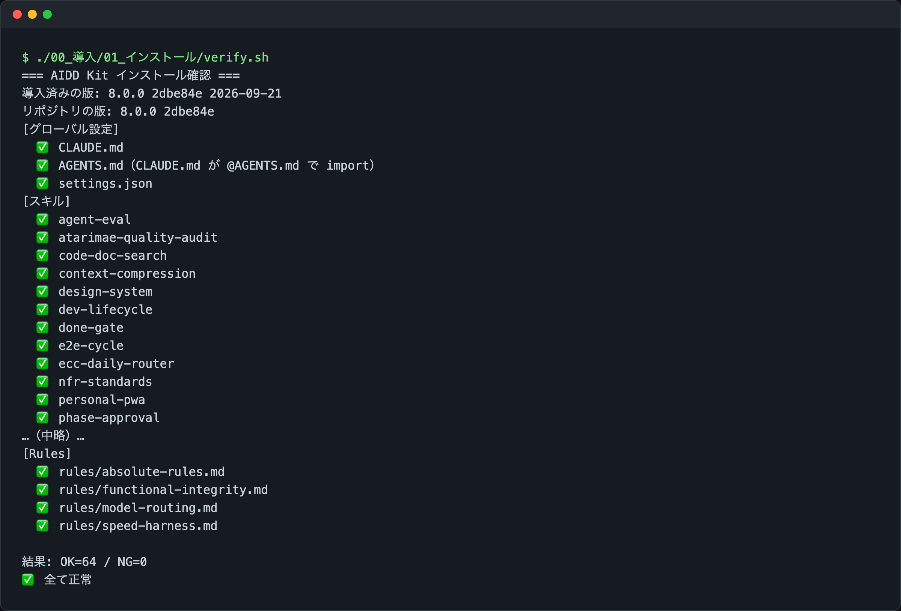

*verify.sh の実行結果。各資産の配置状況と、最後の OK/NG 集計が表示されます。*

**うまくいかないときの確認点**:

- **NG=0 なら導入完了**です。NG が 1 件以上ある場合は終了コード 1 で終わるので、`❌` の行に出ている「未配置: パス」を確認し、`install.sh` を再実行してください
- rules だけ `❌` になる場合は、`~/.claude/rules` の別ディレクトリに同名ファイルがあり、`install.sh` が重複を避けてスキップした可能性があります。`find ~/.claude/rules -name "<ファイル名>"` で実体を確認してください

### ステップ 5: settings.json をマージする（既存の設定がある場合のみ）

ステップ 2 で「settings.json が既存」というメッセージが出た場合は、`03_ClaudeCode/hooks/settings.json` を開き、次の項目を自分の `~/.claude/settings.json` に取り込みます。

- `hooks`（各 hook の配線。`PreToolUse` に instruction-guard・block-ci・pre-read-guard・block-explore・pre-write-check・block-phase・block-gates・filter-output などがぶら下がっています）
- `statusLine`
- トークン節約の設定: `effortLevel`（既定 high）、`autoCompactWindow`、`bashOutputMaxChars`

取り込んだら、ステップ 3 の `install-guard.sh` をもう一度実行し、Claude Code を再起動してください。

---

## 5. 導入手順（プロジェクト配布）

Codex で使う場合や、チームのリポジトリにキットを含めたい場合はこちらです。グローバル導入と違い、`export-project.sh` は対象プロジェクトの `.claude/settings.json` を**新規作成した内容で上書き**します（既存があれば自動で `.bak` に退避したうえで上書きするため、グローバル導入の「上書きしない」方針とは挙動が異なります）。書き出される settings.json は、hooks のコマンドをプロジェクト相対パス（`.claude/hooks/xxx.py` など）で参照する形になっており、プロジェクトルートを作業ディレクトリとして実行される前提です。

```bash
cd ~/dev/yuki-aidd-kit
./00_導入/02_プロジェクト配布/export-project.sh ~/dev/my-app

cd ~/dev/my-app
git add .claude AGENTS.md CLAUDE.md scripts
git commit -m "chore: add AIDD Kit"
```

**何が起きるか**: 対象プロジェクト直下に `.claude/skills` `.claude/commands` `.claude/hooks` `.claude/rules` `.agents/skills` を作り、キットのスキル・コマンド・hooks を**フルコピー**します（グローバル導入のような DAILY/LIBRARY の絞り込みはせず、どのスキルを使うかは各エージェントが `INDEX.md` を見て判断する設計です）。

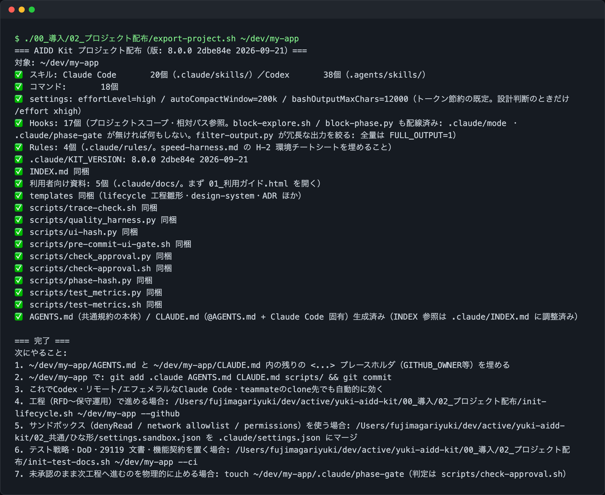

*export-project.sh の実行結果。対象プロジェクト配下にスキル・コマンド・hooks が配置された件数が表示されます。*

**うまくいかないときの確認点**:

- 引数の対象ディレクトリが存在しないと使い方だけ表示して終了します。あらかじめ `mkdir -p` で作成しておいてください
- 生成された `.claude/settings.json` の hooks はプロジェクト相対パスを前提にしています。Claude Code のプロジェクトスコープ hooks がプロジェクトルート以外を作業ディレクトリにする環境では、パスの解決に失敗する可能性があります（スクリプト内のコメントでも要検証と明記されています）
- コミットしておけば、そのリポジトリを clone した人は install なしで同じ規約・hooks・スキルを使えます。Codex では `$done-gate` や `$cmd-trace` のように `$名前` でスキルを呼び出します

### 新規プロジェクトを雛形から作る

```bash
./00_導入/02_プロジェクト配布/init-project.sh my-app pwa   # pwa | html | streamlit
```

`init-project.sh` は git init・`.gitignore`（秘密情報とログ・データファイルを除外）・プロジェクト用 CLAUDE.md・`CURRENT_STATE.md`・SDD 用の空テンプレート（`spec.md` `plan.md` `tasks.md`）を作った上で、第 2 引数の種別ごとに次のスキャフォールドを追加します。

- **pwa**: `docs/manifest.json`（GitHub Pages で `docs/` を公開する構成を前提）と `docs/index.html` の空ファイルを作成します。スマホで使う個人アプリ・localStorage で完結するツールに向いています
- **html**: 単一の `<プロジェクト名>.html` だけを作成します。ビルドや依存関係を持たない、社内配布用デモや使い捨てツールに向いています
- **streamlit**: `requirements.txt`（streamlit）と `app.py` を作成します。RAG 連携や業務支援エージェントのように、Python 側でロジックを持つアプリに向いています

**どちらの方式を選ぶか**は、実行環境と配布形態で決めます。ブラウザだけで完結し配布も URL 共有で済ませたいなら pwa、依存関係ゼロで 1 ファイルを渡したいだけなら html、Python のライブラリ（RAG・LLM 呼び出しなど）が必要なら streamlit、という判断基準になります。迷った場合は `sdd-ecc-workflow` スキル（`/sdd-start`）が種別ごとの判断を案内します。

### 工程文書やテスト文書の雛形を置く

```bash
./00_導入/02_プロジェクト配布/init-lifecycle.sh ~/dev/my-app --github   # 工程文書一式＋Issue/PRテンプレート
./00_導入/02_プロジェクト配布/init-test-docs.sh ~/dev/my-app            # テスト戦略・DoD・29119文書の雛形
```

`init-lifecycle.sh` は `docs/lifecycle/` に RFD〜保守運用の工程文書テンプレートを配置します。`--github` を付けると `.github/` に Issue・PR テンプレートも追加されます。`init-test-docs.sh` は `docs/test/` に TESTING_STRATEGY・DEFINITION_OF_DONE・ISO/IEC/IEEE 29119 準拠の計画書・設計仕様・完了報告・インシデント報告の雛形を置き、あわせて `quality/feature_contracts.yml` と `scripts/quality_harness.py` など機能契約ハーネス一式を配置します。

**うまくいかないときの確認点**: どちらのスクリプトも既存ファイルは上書きせずスキップし、`↷ スキップ（既存）` と表示します。雛形を最新版に更新したい場合は、対象ファイルを一度削除するか別名に退避してから再実行してください。`init-test-docs.sh` は実行後に「次にやること」として、`<PROJECT>` プレースホルダーの置換や `quality_harness.py` の初回実行手順を表示するので、その案内に従って埋めていきます。

---

## 6. 導入後、最初の 1 日の使い方

導入が終わった翌朝、私が最初にやるのは「この案件はどっちの進め方か」を決めることです。`dev-lifecycle` スキルの冒頭に判断表があり、他の人に納品する・引き継ぐ・要件の合意が必要・保守運用が続く案件なら工程ライフサイクル（`/rfd` → `/lifecycle <工程名>` → `/trace`）、個人の PWA・単一 HTML ツール・PoC なら軽量な `sdd-ecc-workflow`（`/sdd-start`）に進みます。迷ったら「進め方を決めたい」とだけ伝えれば、この判断表から案内されます。

進め方が決まったら、実装は必ず「調査」と「実装」を分けます。`/plan` で調査モードに入り、方針・対象ファイル・検証手順を `PLAN.md` に書かせてから、`/implement` で実装モードに切り替えます。`/implement` は `PLAN.md`（またはプロジェクトの plan ファイル）が無いと警告して中断するので、勢いで実装に入ることができません。実装モードに入ると `.claude/mode` が作られ、`block-explore.sh` が Read/Grep/Glob を物理的にブロックします。私はこれを入れる前、実装の途中で「念のため」ともう一度コードを読みに行き、方針がぶれることがよくありました。ブロックされると、方針が足りないと気づいた時点で `/plan` に戻るしかなくなり、結果として手戻りが減りました。

仕上げでは「作った」と「効いている」を分けます。画面を触ったら `uiux_review` で全状態を実際に開き、完了と言う前に `done-gate` を通します。確認していない項目は「未検証」と、その確かめ方まで明記させるのがポイントです。1 日の終わりには `/retro` で Keep / Problem / Try を `lessons.md` に残し、同じつまずきが 2 回出たらスキルか hook に昇格させています。

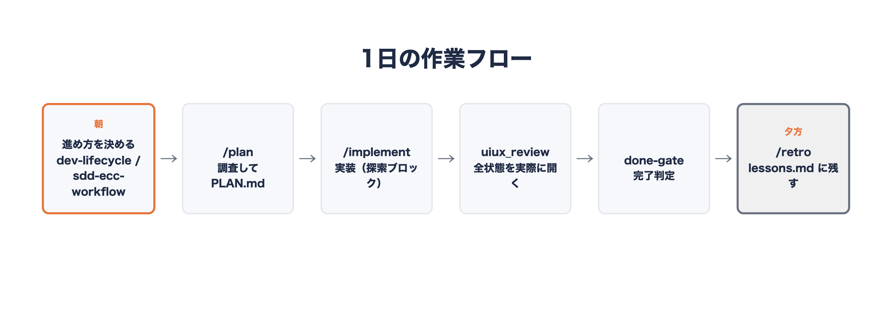

*進め方の判断から /plan・/implement、仕上げの uiux_review・done-gate、retro までの1日の流れ*

## 7. 工程を分ける案件: V字とトレーサビリティ

納品や引き継ぎが絡む案件では `dev-lifecycle` を使います。RFD（提案・論点出し）から要件定義・基本設計・詳細設計・実装・単体テスト・結合テスト・システムテスト・受け入れテスト・保守運用まで、10 の工程それぞれに成果物と ID の付番規則（`REQ-F-001` や `DD-001` など）が決まっています。V 字モデルの対応も固定されていて、要件定義は受け入れテストと、基本設計はシステムテスト・結合テストと、詳細設計は単体テストと対応します。テストを書くときは、まず「左側のどの ID を検証するのか」を先に書かせるようにしています。

各工程は前工程の出口基準を満たさない限り開始しません。共通の出口基準は、未確定の `TBD` が残っていないこと、採番した ID が追跡表に全て載っていること（`trace-check.sh` が NG=0）、`qa-review-standards` の観点で自己レビュー済みであること、そして人間の承認記録があることの 4 点です。ここで重要なのは、**AI は承認しない**という一線です。`phase-approval` スキルでは、追跡担当・仕様一致担当・リスク担当という 3 つの役を同一セッションで順番に回し、指摘を出し切るところまでを AI が担当します。承認欄（`approver`）を埋めるのは人間だけで、承認後に成果物が変われば承認は自動で失効します。3 役を並列でなく順次に回すのは、並列委譲だとトークン消費が約 7 倍になり Pro＋Sonnet の上限に当たりやすいためです。

トレーサビリティの検証も、目視ではなくスクリプトに任せます。`./scripts/trace-check.sh docs/lifecycle` を実行すると、重複定義・未定義参照・要件の設計/テスト未カバー・孤立したテストを機械的に検出します。

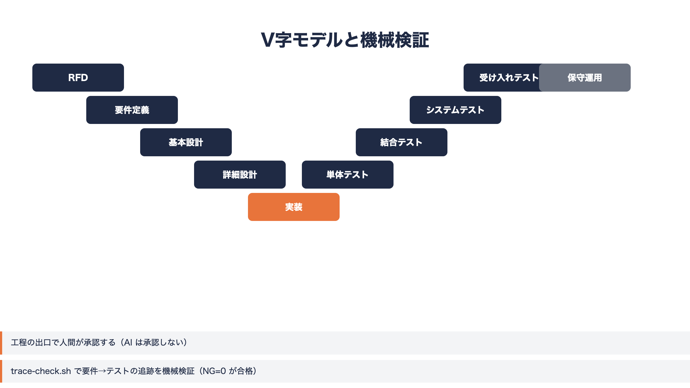

*RFD から保守運用までの10工程とV字の対応（要件定義↔受け入れテスト、基本設計↔システム・結合テスト、詳細設計↔単体テスト）*

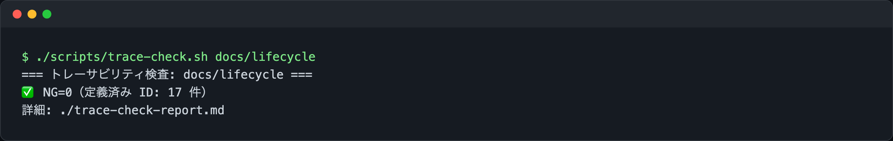

*trace-check.sh を実行した様子（実行結果の数値は未取得のため割愛）*

## 8. テストと完了判定

`test-strategy` スキルでは、テストを L1（単体）・L2（統合）・L3（システム／E2E）・L4（受け入れ）の 4 レベルに分けています。L1・L2 は pytest や Playwright のテストクライアントで、1 件でも FAIL すれば不合格です。L3 はブラウザ上の実フローを Playwright で通すレベルで、1 件でも FAIL すれば `.ui-verified` マーカーが付かず、UI 変更をコミットできない仕組みになっています。L4 は ISTQB のファウンデーションレベル相当の担当者が初見・マニュアルなしで確認し、依頼者が承認するレベルで、ここも AI は承認しません。

このスキルの説明文にある一文が、私にとって一番刺さった注意書きです。「pytest が全 PASS であることは完了ではない。それは L1/L2 の確認にすぎない。L3 と L4 が終わって初めて完了である」。テストが緑でも、ブラウザで実際に開くと崩れている、というのは何度も経験しました。

ゲートの実行タイミングも明確に分けています。日常のコミットではゲートを実行しません（`block-gates.py` が無断実行を止めます）。一方でマイルストーン（機能の区切りやリリース判断）では、L1/L2・L3・lint・security・機能契約ハーネスまで含めたフルゲートを回します。この優先関係を文書に書いていなかったために、以前テスト資産 17 件が 1 週間陳腐化したまま放置された、という実損害が記録に残っています。フルゲートの実測は約 5 分で済むので、迷ったらマイルストーンとして実行する、というのが今の運用です。

完了判定は `done-gate` スキルに集約しています。全種別共通の項目に加え、HTML/JS/CSS を触った場合は L3 の全 PASS と `.ui-verified` の更新、1920×1080 と 1366×768 での実操作確認、`uiux_review` での全状態確認までが必須です。未達の項目が 1 つでもあれば「未完了。残り N 項目」と表示され、全て満たしたときだけ「完了基準を満たしている」と判定します。

## 9. ハンズオン: 1行の依頼から HTML モックまで

キットの使い方を通しで見せるために、社内図書館の貸出管理を Excel から Web にする、という架空の事例を同梱しています。依頼文はたった 1 行です。「社内図書館の貸出管理を Excel から Web システムにする。HTML でモックを作ってください」。

この 1 行から、キットの規律（目的を 1 行で言う・残課題を残さない・未検証は未検証と書く）と `single-html-tool`・`design-system`・`uiux_review`・`done-gate` の手順書だけを使って、ダッシュボード・蔵書・貸出中・利用者・設定の 5 画面が揃った単一 HTML のモックができ上がりました。書き足した CSS はレイアウトの配置に関する 20 行だけで、部品や骨格はキットに同梱されている実物をそのまま使っています。動作確認では、貸出・返却・失敗・0 件・処理中などを含めて Playwright で 14 状態を確認し、360×820 から 1920×1080 までの幅とライト・ダークモードで横スクロールが出ないことを確かめました。

この事例を通しでやってみて分かったことがもう一つあります。部品それぞれのセルフテストでは見つからなかった、キット自身の欠陥が 3 件見つかり、その場で是正しました。個々の部品が正しくても、実際の画面に組み上げると初めて崩れが見える、というのは `uiux_review` を「全状態を実際に開く」手順にしている理由そのものです。

利用ガイドにも同じ事例を使ったハンズオン章があるので、実際に手を動かして試したい方はそちらから辿れます。

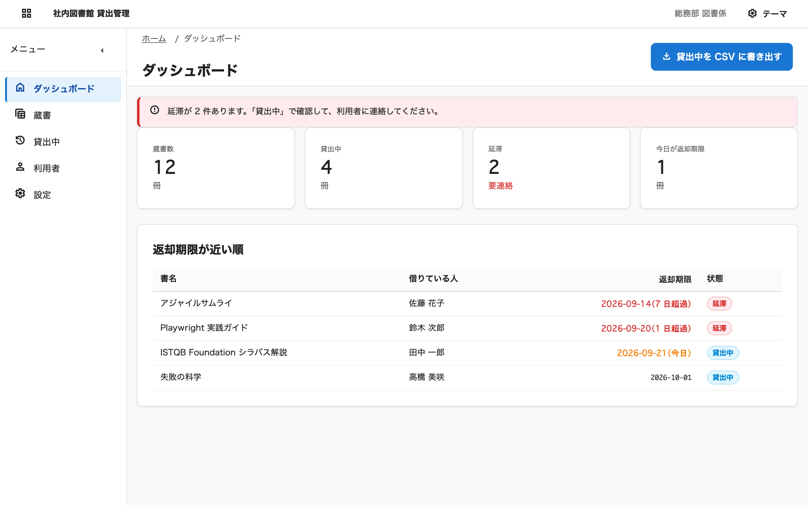

*図書貸出モックの画面。1行の依頼文からキットの部品だけで組み上がった5画面の一つ*

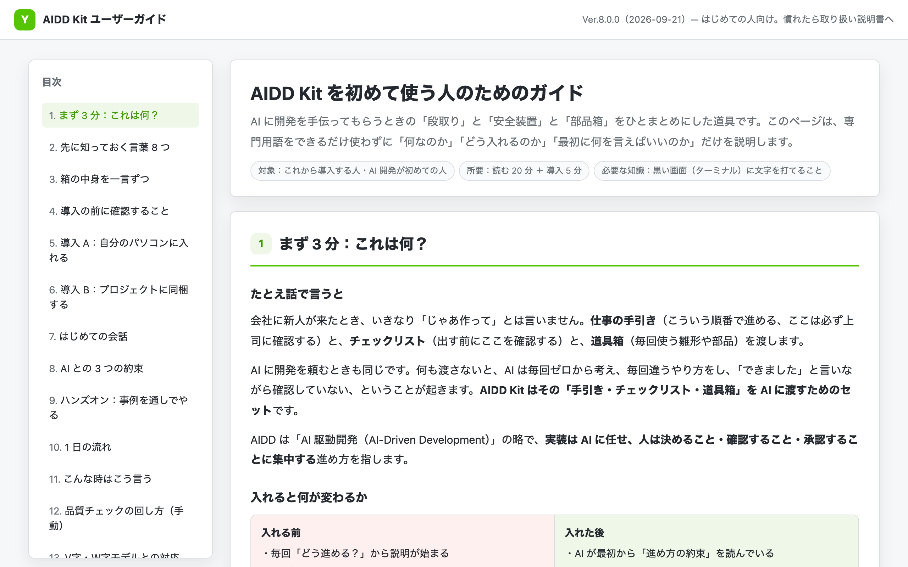

*利用ガイド（01_利用ガイド.html）に収録されているハンズオン章*

---

## 10. トークンを節約する仕組み

規約を hooks に移すと、今度は「hooks 自体が読み込むコンテキスト」が気になり始めました。そこでキットには、トークン消費を構造から削るための設定と hook をまとめて入れています。

まず `03_ClaudeCode/hooks/settings.json` に、トークン節約に直結する 3 つの値を置いています。

- `effortLevel: "high"`: Claude Code 素の既定である xhigh から 1 段下げています。設計判断が要る場面だけ `/effort xhigh` に上げ、終わったら戻す運用です
- `autoCompactWindow: "200k"`: 自動コンパクトが走るウィンドウ幅
- `bashOutputMaxChars: 12000`: Bash の出力をそのまま抱え込まないための上限

その上で、hook が実際の出力を絞ります。`filter-output.py` は PreToolUse で Bash コマンドを書き換える hook で、pytest や npm test などのテストランナーは失敗行の前後と末尾の集計行だけに、`npm install` や `docker build` のような冗長な install・build は末尾 40 行だけに絞ります。件数指定の無い `git log` には `--oneline -20` を、対象指定の無い `git diff` には `--stat` を補います。全量が必要なときは `FULL_OUTPUT=1` を付けて実行すれば元のコマンドがそのまま通ります。

もう 1 つが `pre-read-guard.py` です。こちらは Read そのものを見ていて、ロックファイル・minified・source map・`node_modules` などは「読んでも判断材料にならない」として最初から止めます。800 行を超えるファイルは offset・limit を指定せずに読もうとすると、先頭 300 行だけに絞られ、続きは offset を指定して読む形になります。

長時間の会話を見張るのが `context-guard.py` です。こちらは止めずに警告するだけの hook で、直前の発言から 55 分（サブスクのキャッシュ寿命 1 時間の手前）以上空いて再開したときは「この 1 通は全履歴を再処理する」と伝え、会話の transcript が 4 MB を超えたら `/compact` か `/clear` を促します。判断は人に委ね、材料だけ差し込む設計です。

これらが実際に配線されているかを点検するのが `token-audit.sh`（本体は `token_audit.py`）です。常時読み込まれる分量の推定、実測ログの集計、hook と設定の配線チェック、MCP の数、スキルの肥大化を一度に出し、配線漏れがあれば NG として exit 1 で終わります。私は月に一度これを回して、増えすぎたスキルやルールファイルがないかを確認しています。

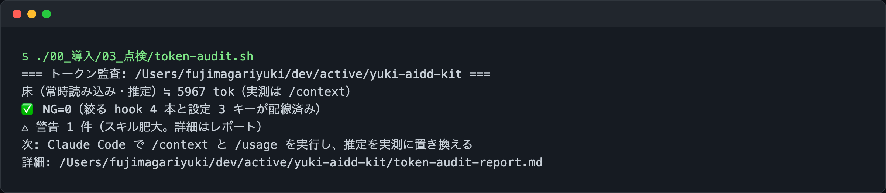

*`/token-check` または `token-audit.sh` を実行したときの端末画面*

## 11. Codex でも同じ規約で動かす

キットは Claude Code 専用ではなく、Codex でも同じ規約で動くように作られています。仕組みの中心は `04_Codex/build_codex_skills.py` です。このスクリプトは `03_ClaudeCode/skills/` と `commands/` を読み込み、Codex の仕様（`<名前>/SKILL.md` に frontmatter の name・description が必須、任意で `agents/openai.yaml`）に合わせて `04_Codex/skills/` を生成します。Claude Code のスラッシュコマンドも同じ扱いでスキルに変換されるため、`/trace` のようなコマンドは Codex 側では `$cmd-trace` のような名前で呼び出せます。生成本数は現時点で 38 本です。`--check` オプションを付けて実行すると、生成物が最新かどうかを差分で検査し、ずれていれば exit 1 で終わります。つまり Claude Code 側のスキルを直接書き換えても、Codex 側の生成物が古いままにならないよう機械で検査できる形になっています。

規約の本体を 1 か所にまとめているのも同じ狙いからです。`AGENTS.md` に規約を書き、Claude Code は `CLAUDE.md` の `@AGENTS.md` インポートでこれを読み込み、Codex は `AGENTS.md` を直接読みます。私が実際に困ったのは、最初のうちは Claude Code 用の CLAUDE.md と Codex 用の設定を別々に育ててしまい、気づいたら内容がずれていたことでした。規約を 1 本化してからは、エージェントを切り替えるたびに文言を合わせ直す作業がなくなりました。

Codex にはフックの仕組みが無いため、`block-gates.py` や `filter-output.py` のような「機械的に止める・絞る」層はそのままでは持ち込めません。プロジェクト配布（`export-project.sh`）で書き出した `.claude/` や `scripts/` はあくまで Claude Code 向けで、Codex 側は AGENTS.md の規約とスキルの手順書に沿って動く形になります。この違いは把握した上で使う必要があります。

## 12. 作ってみて分かったこと

キット自身の学びは `06_保守者向け/学んだこと.md` に Keep / Problem / Try の形で溜めています。中でも印象に残っているのが、社内の貸出管理ツールをモックで作ってキットの手順を検証したときの話です。`init-project.sh` でプロジェクトを作り、`export-project.sh` で配布し、`design-system` と `single-html-tool` の手順で画面を組み、`check-design.sh` を実行したところ、配布先では NG=426 という結果になりました。キット自身の 7 ファイルに対しては NG=0 だったため、それまで気づけていなかった不具合です。原因は `tokens.css` の置き場所や `.claude/` の走査範囲、貼り込んだ定義行の扱いにありました。「出荷物が自分自身のテストを通ること」と「配布先で実際に使えること」は別物だと、身をもって学びました。

もう 1 つの気づきは、デモ用の文言の長さです。`layout.css` の globalbar は、短いサンプル文言では崩れませんでしたが、実案件の「社内図書館 貸出管理」＋「総務部 図書係」＋テーマ切り替えという現実的な長さの文言に差し替えたところ、幅 360px で初めて折り返しが崩れました。デモやサンプルは、実際に使うときの文言の長さで作らないと、崩れを見逃すという教訓です。

CHANGELOG.md を振り返ると、キットは Ver.6.1 の速度ハーネス・機能完全性・UI 実機レビューから始まり、6.2 でテスト活動の設計、6.4 で工程承認ゲート、6.5〜6.7 でトークン節約と保守者の傾向の埋め込み、6.8 で指示優先を hook で強制、7.0〜7.1 で配布物と保守者専用の分離、8.0 で Claude Code と Codex の構成分離という順に育ってきました。散文の注意書きを 1 つずつ機械の仕組みに置き換えていった過程が、そのままバージョン履歴になっています。

## 13. 困ったとき

- **テストや lint が実行されない**: `block-gates.py` によるものです。「テストを回して」と頼めば `GATES_REQUESTED=1` 付きで実行されます
- **ログが途中までしか表示されない**: `filter-output.py` が絞っています。テストランナー・install・build・`git log`・`git diff` が対象で、全量が必要なときは `FULL_OUTPUT=1 <コマンド>` で実行してください（例: `FULL_OUTPUT=1 GATES_REQUESTED=1 pytest tests/`）
- **ファイルが途中までしか読まれない**: 800 行を超えるファイルを offset・limit 指定無しで読もうとすると、先頭 300 行に絞られます。続きは offset を指定して読ませてください
- **Bash の出力が長すぎて省略される**: `bashOutputMaxChars`（既定 12000）が上限です。必要な範囲だけを `grep` や `head` で絞ってから読む運用にしています
- **配布先でだけ検査が NG になる**: `check-design.sh` はキット内で NG=0 でも、配布先の実プロジェクトでは配置や貼り込みの違いで NG が出ることがあります。配布したら一度は検査を回して確認してください
- **トークン節約が効いているか確かめたい**: `/token-check`、またはキットの checkout で `./00_導入/03_点検/token-audit.sh` を実行します。配線漏れがあれば NG として教えてくれます

より詳しい使い方は、同梱の HTML ガイドにまとめています。

```bash
open 01_利用者向け資料/01_利用ガイド.html       # 概要と導入（初めての方向け）
open 01_利用者向け資料/02_操作マニュアル.html   # 取り扱い説明書（13 章）
```

## 14. 注意点

- 個人用に作ったキットなので、ルールは私の働き方（速度優先・日本語・QA 観点）に寄せています。ルールファイルは Markdown なので、合わない部分は自由に書き換えてください
- hook は Claude Code 全体に効きます。グローバル導入する前に、まず 1 つのプロジェクトでプロジェクト配布方式を試すという順番でも構いません
- 「キット自身のテストが通ること」と「配布先で使えること」は別問題です。プロジェクト配布のあとは、そのプロジェクトで一度 `check-design.sh` や `verify.sh` を回してから使い始めることをおすすめします
- Codex 側の生成物（`04_Codex/skills/`）は `build_codex_skills.py` が自動生成するもので、直接編集する対象ではありません。変更するのは常に `03_ClaudeCode/skills/` や `commands/` 側です
- 版は `VERSION` と git tag で管理しており、変更内容は `CHANGELOG.md` にまとめています。8.0.0 時点では Claude Code 用（`03_ClaudeCode/`）と Codex 用（`04_Codex/`）を分ける構成管理になっています

## おわりに

規約を「書いて頼む」ものから「仕組みで止める」ものに置き換えていく作業は、地味ですが積み重ねると効きます。ツール呼び出しのたびに未応答の指示を差し込む hook、テストや lint を要求時だけ回す hook、出力を絞る hook。1 つひとつは小さな仕組みですが、これらが揃うと「毎回同じことを言う」コストが下がり、Claude Code と Codex のどちらを使っていても同じ基準で動かせるようになりました。

キットは公開しているので、気になった部品だけ取り出して使っていただいても大丈夫です。感想や改善案は GitHub の Issue でお待ちしています。

https://github.com/ma-garin/yuki-aidd-kit
